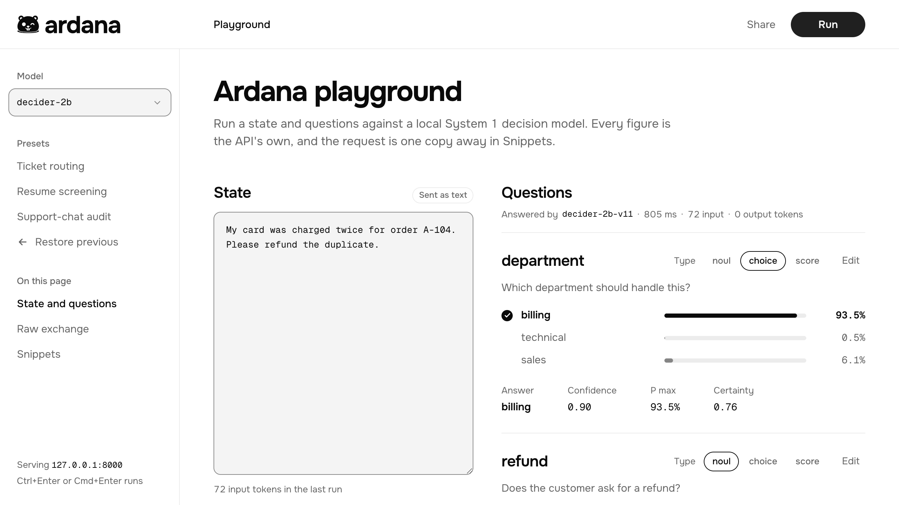

<p align="center">
  <a href="https://ardana.ai">
    <picture>
      <source media="(prefers-color-scheme: dark)" srcset="docs/assets/logo-dark.svg">
      
    </picture>
  </a>
</p>

<h3 align="center">Run System 1 decision models locally.</h3>

<p align="center">
  <a href="https://ardana.ai">Website</a> |
  <a href="https://ardana.ai/models/">Models</a> |
  <a href="https://ardana.ai/playground/">Playground</a>
</p>

Ardana pulls and runs open decision models on your machine, the way Ollama runs chat models. Give a model some text
and a few questions. It reads everything once and answers each question with a probability for every option. It
never writes text, so there is nothing to parse and nothing to retry.

<p align="center">
  
</p>

## Install

macOS and Linux:

```shell
curl -fsSL https://ardana.ai/install.sh | sh
```

Windows (PowerShell):

```shell
irm https://ardana.ai/install.ps1 | iex
```

It is one binary, installed in `~/.local/bin`.

## Get started

```shell
ardana run decider-2b \
  "My card was charged twice for order A-104. Please refund the duplicate." \
  --choice "Which department should handle this?" billing technical sales \
  --noul "Does the customer ask for a refund?"
```

```
Which department should handle this?
  * billing    93.5%
    technical   0.5%
    sales       6.1%
    confidence 0.90, p max 93.5%, certainty 0.76

Does the customer ask for a refund?
    probability of yes  0.93
```

The first run downloads the model (1.3 GB). After that this answer takes about a tenth of a second on an M1 MacBook.

A question is one of three types:

| Type     | You give               | You get                                           |
| -------- | ---------------------- | ------------------------------------------------- |
| `choice` | 2 to 255 named options | The option picked, and every option's probability |
| `score`  | 2 to 10 ordered levels | The level picked, and a score along the scale     |
| `noul`   | A yes-or-no question   | The probability of yes                            |

## Models

```shell
ardana pull qwen3.5-0.8b   # download a model
ardana list                # models on this machine
ardana rm qwen3.5-0.8b     # remove one
```

The library is at [ardana.ai/models](https://ardana.ai/models/). `decider-2b` is the default; `decider-0.8b` is the
smallest. Any GGUF on Hugging Face works too (`ardana pull hf.co/<org>/<repo>`), and so does a model already in your
Ollama store (`ardana pull ollama:llama3.2`).

## API

```shell
ardana serve
```

```shell
curl http://127.0.0.1:8000/v1/systemone -H 'content-type: application/json' -d '{
  "model": "decider-2b",
  "state": "My card was charged twice for order A-104. Please refund the duplicate.",
  "questions": {
    "department": {
      "type": "choice",
      "instructions": "Which department should handle this?",
      "criteria": ["billing", "technical", "sales"]
    },
    "refund": { "type": "noul", "instructions": "Does the customer ask for a refund?" }
  }
}'
```

```json
{
  "model": "decider-2b-v11",
  "answers": {
    "department": {
      "type": "choice",
      "choice": "billing",
      "confidence": 0.9019,
      "probabilities": { "billing": 0.9346, "technical": 0.0049, "sales": 0.0605 },
      "x_p_max": 0.9346,
      "x_certainty": 0.7643
    },
    "refund": { "type": "noul", "noul": 0.9261 }
  },
  "usage": { "input_tokens": 72, "output_tokens": 0 }
}
```

A model that is not on the machine yet is pulled by the first request that names it.

The API is compatible with [TypeSafe](https://docs.typesafe.ai) clients. Point the SDK at your server:

```python
# pip install typesafe-sdk
# TYPESAFE_BASE_URL=http://127.0.0.1:8000 TYPESAFE_API_KEY=any python decide.py
from typesafe_sdk import TypeSafeClient

with TypeSafeClient() as client:
    response = client.system_one(
        model="decider-2b",
        state="My card was charged twice for order A-104. Please refund the duplicate.",
        questions={"refund": {"type": "noul", "instructions": "Does the customer ask for a refund?"}},
    )

print(response.answers["refund"].noul)
```

## Playground

`ardana serve` also serves a playground at http://127.0.0.1:8000. Try a state and questions, read the answers, and
copy the request as curl, Python or TypeScript.

<p align="center">
  <picture>
    <source media="(prefers-color-scheme: dark)" srcset="docs/assets/playground-dark.png">
    
  </picture>
</p>

To try it without installing anything, open [ardana.ai/playground](https://ardana.ai/playground/). It runs a small
model in your browser tab.

## Build from source

Ardana is written in Rust. llama.cpp runs the models.

```shell
cargo xtask fetch    # tools and test models, into tmp/
cargo xtask build    # the playground, then target/release/ardana
cargo test --workspace
```

`CLAUDE.md` describes the workspace, and `docs/guidelines/` has the rules for each part of the stack.

## License

[Apache-2.0](LICENSE)
